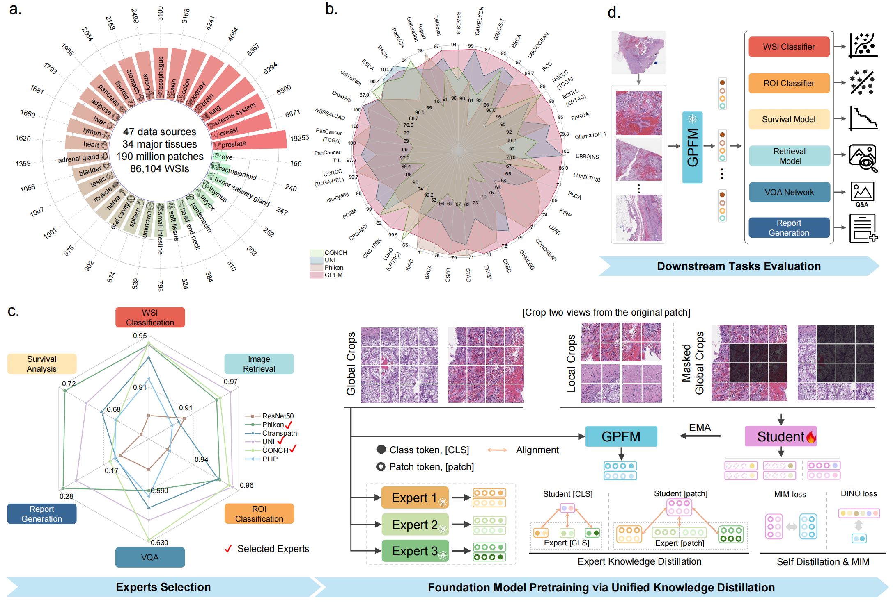
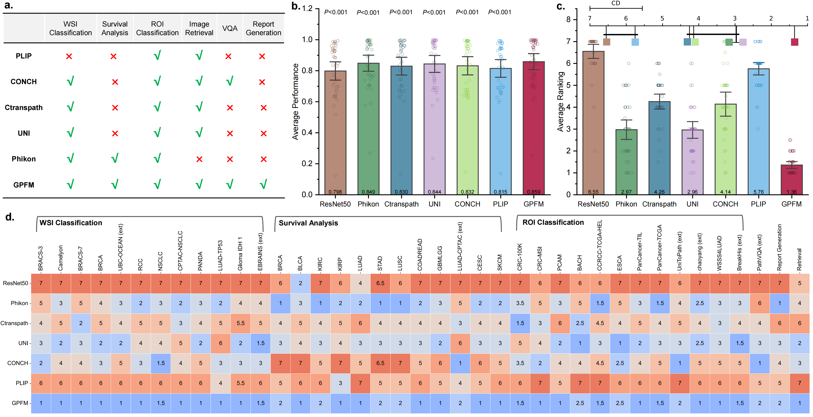

<!-- # GPFM
## Towards A Generalizable Pathology Foundation Model via Unified Knowledge Distillation -->

[](https://arxiv.org/abs/2407.18449)

[](https://huggingface.co/majiabo/GPFM)
[](https://x.com/SMARTLab_HKUST)
--- 


The official implementation of [GPFM](https://arxiv.org/pdf/2407.18449). 
This project is based on the following great projects:
* [CLAM](https://github.com/mahmoodlab/CLAM)  
* [Dinov2](https://github.com/facebookresearch/dinov2)  
see others works of HKUST [SmartLab](https://hkustsmartlab.github.io/) 
 
## TODO List
- [ ] Huggingface lib is under preparing  
- [ ] Downstream tasks are under preparing  

# How to use GPFM as feature extractor
## Only using Feature extractor  
```python
from models import get_model, get_custom_transformer
from PIL import Image

model = get_model('GPFM', 0, 1)
transformer = get_custom_transformer('GPFM')
img = Image.open('img/path') # we prefer image with size of 512*512 (extracted from 40X)
img = transformer(img) 
img = img[None] # to 4D tensor
img = img.cuda() # load images into gpu
feat = model(img) # [N, 1024]

```

## Using this project
Take the UBC_OCEAN dataset as an example  
Step 1: segment the tissue of the WSI  
```bash
cd Patching
bash get_coor_scripts/UBC_OCEAN.sh
```
Step 2: extract the features using foundation model. Currently, we support ResNet, Ctranspath, PLIP, Phikon, CONCH, UNI, and GPFM.
```bash
# download the weights of released GPFM and put it at `models/ckpts/`.  
cd root_dir_of_project
bash extract_scripts/UBC_OCEAN.sh
```
Click [here](https://github.com/birkhoffkiki/GPFM/releases/download/ckpt/GPFM.pth) to download pretrained GPFM.  
If you want to use other foundation models, please download the weights and put them at `models/ckpts/`. You can see the `models/__init__.py` for the supported model. You can also simply define your own model (see `models/phikon.py`).  

## Using Huggingface
see https://huggingface.co/majiabo/GPFM for details. (Note: under preparing)  

# How to use unified knowledge distillation to pretrain your model
If you use Slurm system, you could use `pretrain/train_script.sh` to pretrain your model. Note that the default Experts used in this project is `UNI`, `CONCH`, and `Phikon`. Please remeber to download the weights of these models and put them at `pretrain/dinov2/weights/`.  
If you want to change the expert, you could modify the code at `pretrain/dinov2/train/ssl_meta_arch.py` (see line 57).

## Link to get experts
* [UNI](https://huggingface.co/MahmoodLab/UNI) 
* [CONCH](https://huggingface.co/MahmoodLab/CONCH) 
* [Phikon](https://huggingface.co/owkin/phikon)


# The overall results


# Downstream tasks evaluation

## WSI Classification & Survival Analysis 
This part is base on the [CLAM](https://github.com/mahmoodlab/CLAM) project.  
Step 3: run mil model to perform WSI classificatino or survival analysis.
```bash
cd root_dir_of_project
bash train_scripts/UBC_OCEAN.sh
```
For WSI classification with train-val-test (7:1:2) splits, please use `splits712`  
For WSI classification with K-fold validation, please use `splits`  
For Survival Analysis tasks, please use `splits82`  
## Report Generation
see [HistGen](https://github.com/dddavid4real/HistGen) for details.
## ROI Tasks 
Step 1: extract features using FM.
```bash
cd ROI_tasks
bash ROI_tasks/scripts/extract_feat.sh
```
* ROI classification

```bash
bash ROI_tasks/scripts/linear.sh
```
* ROI retrieval
```bash
bash ROI_tasks/scripts/roi.sh
```

# Citing GPFM
If you find this repository useful, please consider giving a star ⭐ and citation 🦖: 

@article{GPFM,  
  title={Towards A Generalizable Pathology Foundation Model via Unified Knowledge Distillation},  
  author={Ma, Jiabo and Guo, Zhengrui and Zhou, Fengtao and Wang, Yihui and Xu, Yingxue and Cai, Yu and Zhu, Zhengjie and Jin, Cheng and Jiang, Xinrui and Lin, Yi and Han, Anjia and others},  
  journal={arXiv preprint arXiv:2407.18449},  
  year={2024}  
}
